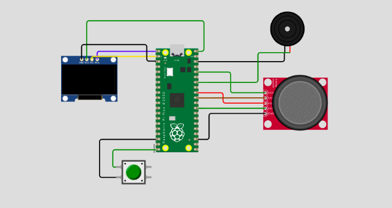

# Pico Space Invaders :rocket:

This is a 2D, first-person space shooter game using Raspberry Pi Pico. The game, similar to the classic Space Invaders, will feature different controls, using a joystick for player movement and a push button for shooting. The objective of the game is to defend Earth from alien invasion. The game industry, which has grown into a multi-billion dollar industry since the 1970s, is moving towards complex 3D games, but we want to create a simple and easy-to-use game that can be played by students. Our game will have a high fun factor, no learning curve, and short startup time. Using the Raspberry Pi Pico, a dual-core Arm Cortex processor with 2 Mb Flash Memory, we aim to demonstrate that simple games can be created with this technology.

## Things Required :shopping_cart:

* Raspberry Pi Pico
* Breadboard
* Jumper wires
* Electromagnetic Buzzer 
* Push Button Tactile Switch
* Joystick Module
* 0.96-inch I2C OLED display(ssd 1306) 

## Circuit Diagram :robot:



## Implementation :truck:


## How to Setup? :thinking:

After making all the necessary connections, save all below files into your Raspberry Pi Pico.

```
.
├── configs.py
├── enemy.py
├── main.py
├── player.py
├── sound.py
└── ssd1306.py
```

And just run main.py, to start the game. :smile:
